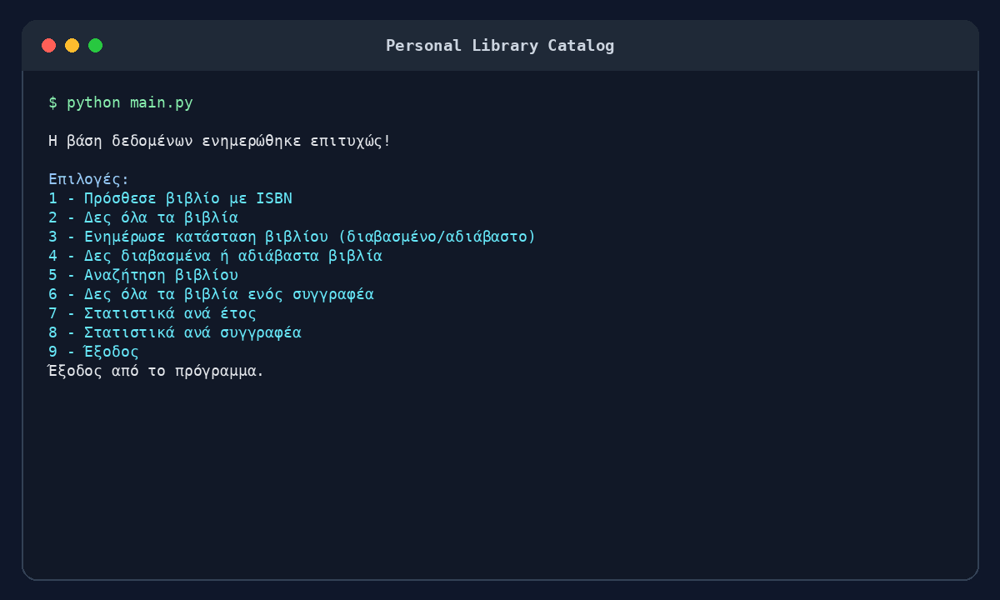
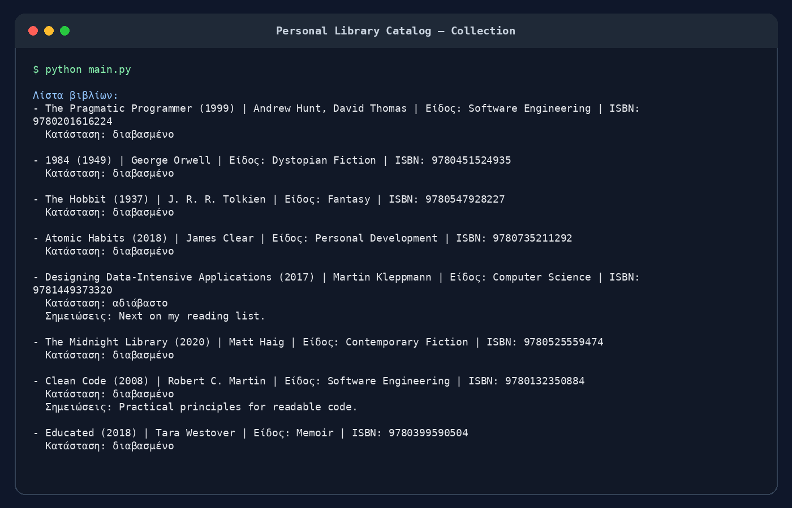
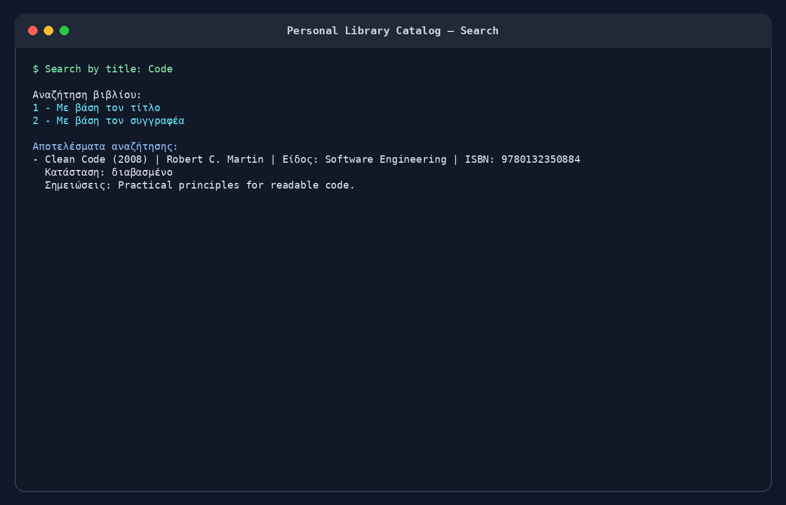
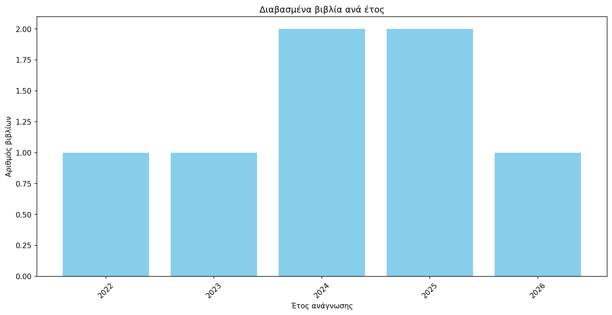

# Personal Library Catalog

A Python command-line application for cataloguing a personal book collection. It retrieves book metadata from the Google Books API using an ISBN, stores the collection in a normalized SQLite database, tracks reading progress and produces reading statistics with Matplotlib.

> The interface is currently available in Greek.



[Watch the MP4 demo](assets/demo.mp4)

## Highlights

- ISBN-10 and ISBN-13 validation, including checksum verification
- Book metadata lookup through the Google Books API
- Manual entry fallback when the API has no result
- Normalized SQLite schema for books, authors and genres
- Duplicate detection across equivalent ISBN-10/ISBN-13 values
- Reading status, notes and reading-year tracking
- Search and filtering by title, author and reading status
- Reading statistics and Matplotlib charts
- Transaction handling and schema migration support
- 28 automated tests using temporary databases and mocked API calls

## Screenshots

### Collection overview



### Search and filtering



### Reading statistics



## Tech stack

- Python 3.9+
- SQLite
- Google Books API
- Requests
- Matplotlib
- unittest

## Run locally

```bash
git clone https://github.com/ekotsoni-3w/personal-library-catalog.git
cd personal-library-catalog

python3 -m venv .venv
source .venv/bin/activate        # macOS / Linux
# .venv\Scripts\activate       # Windows PowerShell

python -m pip install -r requirements.txt
python main.py
```

The application creates `books.db` next to `database.py` on first launch. The database is excluded from version control, so personal library data is never included in the repository.

## Main menu

| Option | Action |
| --- | --- |
| 1 | Add a book using its ISBN |
| 2 | Display the complete collection |
| 3 | Update reading status and reading year |
| 4 | Filter read or unread books |
| 5 | Search by title or author |
| 6 | Display books by a selected author |
| 7 | View reading statistics by year |
| 8 | View reading statistics by author |
| 9 | Exit |

## Project structure

```text
personal-library-catalog/
├── main.py                 # Application entry point and menu
├── database.py             # SQLite schema, transactions and queries
├── api.py                  # Google Books API integration
├── book_actions.py         # Add and update workflows
├── reports.py              # Search, reports and charts
├── validation.py           # ISBN, year and status validation
├── constants.py            # Shared status constants
├── init_db.py              # Standalone database initialization
├── update_read_year.py     # Reading-year maintenance command
├── test_books.py           # Automated test suite
├── requirements.txt
└── assets/                 # Portfolio screenshots and demo
```

## Tests

```bash
python -m unittest -v
```

The suite covers validation, API success and failure, duplicate detection, schema migration, transaction rollback, report queries and interactive workflows. Tests use isolated temporary SQLite databases and do not require network access.

## Design notes

- Database operations are separated from user input and reporting.
- Parameterized SQL queries are used throughout the application.
- Writes are wrapped in transactions; duplicate checks are repeated inside an immediate transaction.
- ISBN-10 values are converted to a comparable ISBN-13 key when checking for equivalent editions.
- API failures do not prevent local collection management or manual entry.

## Current scope

This is a local, single-user CLI application. It does not include user accounts, cloud synchronization or a graphical interface. Those are possible future extensions, not current features.

## Author

**Eleftheria Kotsoni**  
[GitHub](https://github.com/ekotsoni-3w)

## Copyright

Copyright (c) 2026 Eleftheria Kotsoni. All rights reserved. The source code is publicly visible for portfolio evaluation; no permission is granted to copy, modify, distribute or reuse it.
